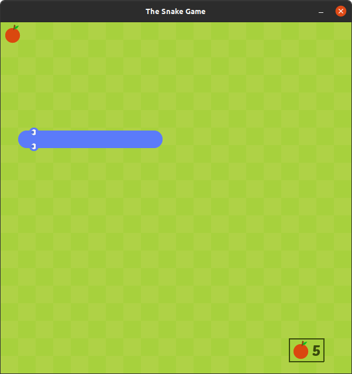
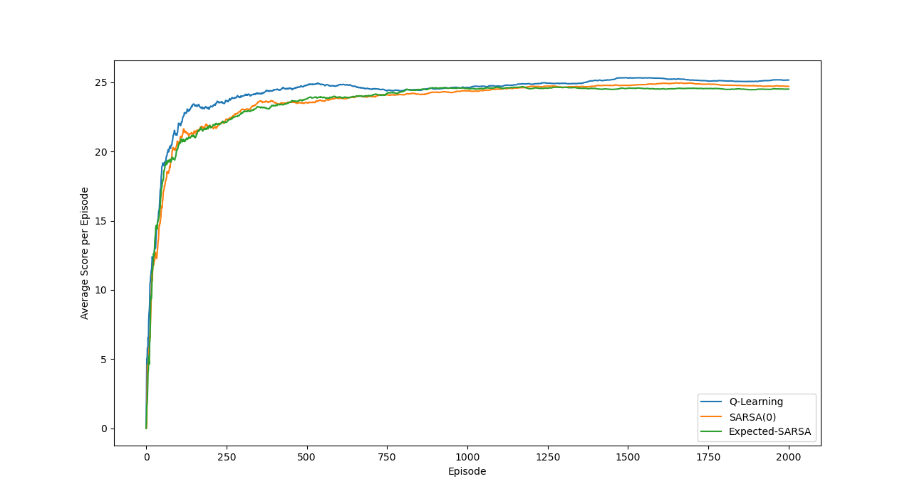

# The Main Game
This file contains code for the actual game built using Pygame as well as the Tabular RL agent.

## Basic Game
The original implementation can be found [here](https://github.com/clear-code-projects/Snake). The code has been refactored for the purposes of this project. Separate classes have been used for the _Snake Agent_, _Environment_ and _Reward_.

The game can be played through the following command:
```bash
python3 snake_game.py
```

## Mastering the Game using RL
### State Space
My representation uses 7 bits of information to describe the current state of the snake:
* 4 bits of information to define the relative position of the fruit with respect to the head of the snake
* 3 bits of information for obstacles right in front of the head, to the immediate right and left of the head

An alternative state space representation could utilise 8 bits, treating the up, down, left and right directions separately.

### Action Space
The snake has 3 possible actions:
* Do nothing: The snake continues to move in the same direction
* Turn right: The snake turns right to change its direction
* Turn left: The snake turns left to change its direction

An alternative action space could consist of 4 actions - **up, down, left, right**.

### Reward Scheme
I have used a fairly simple reward scheme that can be optimized to improve the performance of the agent:
* Reward of +5 if the snake moves closer to the fruit
* Reward of -5 if the snake moves away from the fruit
* Reward of +500 for eating the fruit
* Reward of -1000 for crashing  

### Hyperparameters
The starting learning rate and &epsilon; parameter for an &epsilon;-greedy policy are 0.5 and 0.01. Without decaying these hyperparameters, the training behaviour of the agent is extremely erratic. With annealing, the performance is more consistent. The agent has achieved a maximum score of 64.

The python file `agent.py` accepts the following command-line arguments:
* `--algorithm` followed by the algorithm to train the agent. The options include **Sarsa, Q-Learning, Expected-Sarsa, Dyna-Q, compare**. _Compare_ plots the relative performance of the algorithms
* `--episodes` followed by the number of episodes to train the agent for

Example Usage:
```bash
python3 agent.py --algorithm q-learning --episodes 500
```

The training phase is run at a higher fps. Every **10** episodes, the game is slowed down to observe the progress of the agent. This is also used to plot the average reward obtained by the agent.


