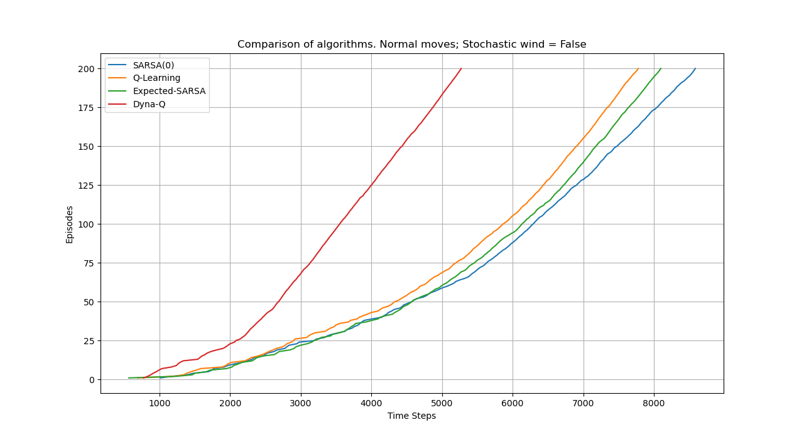

# Windy Gridworld
This assignment was a part of the course _CS747: Foundations of Intelligent and Learning Agents_ offered at IIT Bombay.

The task was to implement the _Windy Gridworld_ task given as _Example 6.5 by Sutton and Barto (2018)_. The agent is supposed to navigate a standard gridworld with a crosswind running upward through the middle of the grid. There are four actions - __up, down, left and right__ but the agent is additionally pushed upwards by the wind.    

The problem can be formulated as an undiscounted, episodic task with a constant reward of __-1__. The negative reward motivates the agent to reach the end goal as soon as possible.

The python file `main.py` accepts the following command-line arguments:
* `--algorithm` followed by the algorithm to train the agent. The options include **Sarsa, Q-Learning, Expected-Sarsa, Dyna-Q, compare**. _Compare_ plots the relative performance of the algorithms
* `--moves` followed by the allowed moves - **normal, king**. _Normal_ only allows the agent to move **up, down, left and right** while _King_ allows the agent to move **diagonally**
* `--stochastic` followed by **0 or 1** due to which the wind will push the agent through random distances

and plots the progress of the agent during the learning phase. The slope of the plot indicates the time the agent is spending per episode and a higher slope indicates a faster route.

Usage Examples:
```bash
python main.py --algorithm sarsa --moves normal --stochastic 0
python main.py --algorithm compare --moves king --stochastic 1
```

We can also visualize the shortest path using `visualizer.py` which accepts the following command-line argument:
* `--moves` followed by the allowed moves - **normal, king**
* `--solution` followed by the path to the solutions (can be found [here](solutions/))

Usage Examples:
```bash
python visualizer.py --moves normal solutions/optimal-normal-path.txt
python visualizer.py --moves king solutions/optimal-kings-path.txt
```


[Reference to Original Assignment](https://www.cse.iitb.ac.in/~shivaram/teaching/old/cs747-a2020/pa-3/programming-assignment-3.html)
